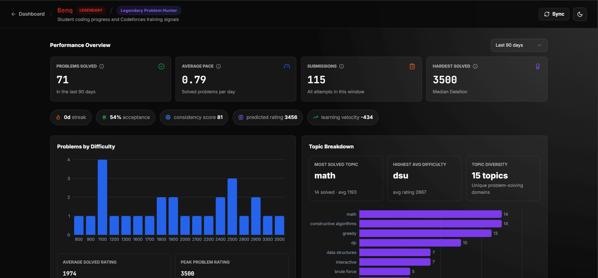
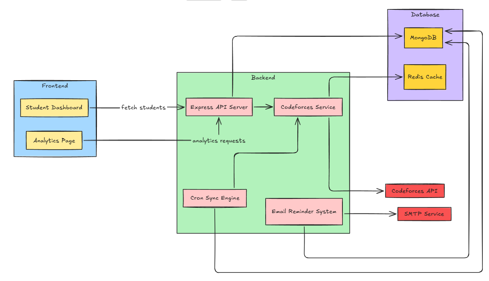
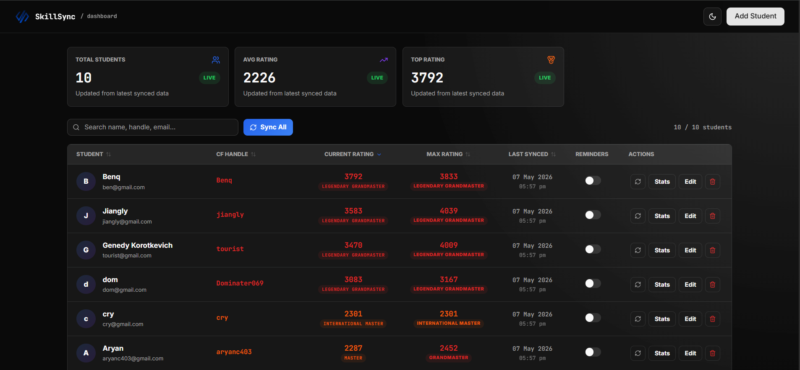
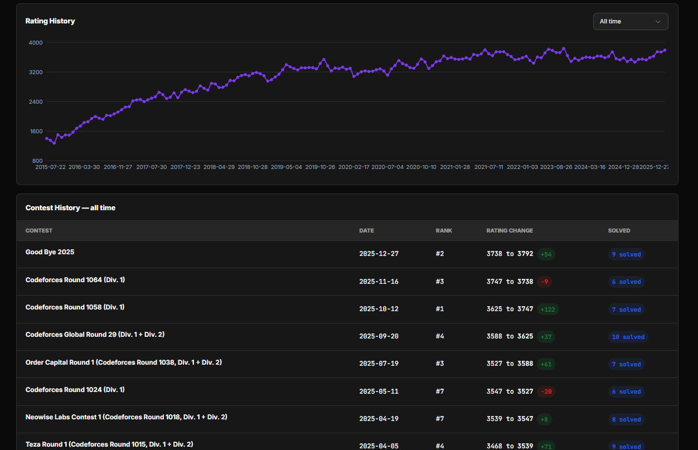

# SkillSync 📊

<div align="center">



### Competitive Programming Analytics Platform for Student Performance Tracking

A full-stack analytics platform built to monitor, analyze, and visualize competitive programming progress using real-time Codeforces data, automated synchronization pipelines, Redis-backed caching, and performance insights.

[Live Demo]([https://your-vercel-app.vercel.app](https://student-progress-tracker-pi.vercel.app/)) • [Documentation]([https://your-mintlify-docs.vercel.app](https://mintlify.wiki/aakash811/Student-Progress-Tracker))

</div>

---

## ✨ Overview

SkillSync is a production-style coding analytics dashboard designed to help students, mentors, and educators track competitive programming performance at scale.

The platform combines:

- 📈 Real-time analytics dashboards
- ⚡ Redis-backed API caching
- 🔄 Automated cron-based synchronization
- 📊 Contest and submission insights
- 🔥 Activity heatmaps and consistency tracking
- 📧 Inactivity reminder pipelines
- 🌙 Modern responsive SaaS-style UI

---

# 🚀 Core Features

## 📊 Analytics Dashboard

- Student performance overview
- Contest rating progression
- Problem difficulty distribution
- Tag-based problem analysis
- Submission activity heatmaps
- Coding consistency metrics
- Personalized coding insights

---

## ⚡ Performance Optimizations

- Redis caching layer for Codeforces API data
- Reduced API latency using intelligent caching
- Background synchronization system
- Optimized analytics aggregation
- Efficient contest/submission processing

---

## 🔄 Automation System

- Daily cron-based synchronization pipeline
- Manual sync orchestration from dashboard
- Automatic inactivity detection
- Email reminder system for inactive users
- Background sync execution

---

## 🎨 Modern Product UI

- Responsive analytics dashboard
- Dark / Light theme support
- Interactive charts and visualizations
- Smooth skeleton loading states
- SaaS-inspired dashboard design
- Real-time sync status indicators

---

# 🏗️ System Architecture

<div align="center">



</div>

---

# 📷 Dashboard Preview

## Student Dashboard

<div align="center">



</div>

---

## Analytics & Performance Tracking

<div align="center">


</div>

---

## Rating Progression & Contest Insights

<div align="center">



</div>

---

# 🛠️ Tech Stack

## Frontend

- React.js
- Vite
- TailwindCSS
- shadcn/ui
- Recharts
- Axios

---

## Backend

- Node.js
- Express.js
- MongoDB
- Mongoose
- Redis
- Node-cron
- Nodemailer
- Codeforces Public API

---

# ⚙️ Engineering Highlights

## 🔥 Redis-Based API Caching

Implemented a Redis caching layer to reduce repetitive Codeforces API requests and improve dashboard response times significantly.

---

## 🔄 Background Sync Orchestration

Built a cron-based synchronization engine capable of:
- refreshing user analytics
- invalidating stale cache
- syncing contest history
- updating submissions
- triggering inactivity workflows

---

## 📈 Advanced Analytics Engine

The analytics pipeline computes:
- difficulty distributions
- coding streaks
- activity consistency
- contest progression
- tag-wise performance
- acceptance rate metrics

---

## 📧 Inactivity Reminder System

Integrated SMTP-based reminder workflows using Brevo and Nodemailer to notify inactive students automatically.

---

# 📂 Project Structure

```bash
Student-Progress-Tracker/
│
├── frontend/
│   ├── src/
│   │   ├── components/
│   │   ├── pages/
│   │   ├── assets/
│   │   └── lib/
│   │
│   └── public/
│
├── backend/
│   ├── controllers/
│   ├── cron/
│   ├── models/
│   ├── routes/
│   ├── services/
│   ├── utils/
│   └── index.js
│
└── README.md
```

---

# 🌐 Documentation

Full technical documentation available here:

👉 https:[//your-mintlify-docs.vercel.app](https://mintlify.wiki/aakash811/Student-Progress-Tracker)

---

# ⚙️ Setup Instructions

## Prerequisites

- Node.js v18+
- MongoDB
- Redis
- Git

---

## 1️⃣ Clone Repository

```bash
git clone https://github.com/yourusername/student-progress-tracker.git

cd student-progress-tracker
```

---

## 2️⃣ Backend Setup

```bash
cd backend
npm install
```

Create `.env` file:

```env
PORT=5000

MONGODB_URI=your_mongodb_uri

REDIS_URL=your_redis_url

CRON_SECRET=your_secret

EMAIL_USER=your_email

EMAIL_PASS=your_email_password
```

Run backend:

```bash
npm run dev
```

---

## 3️⃣ Frontend Setup

```bash
cd ../frontend
npm install
npm run dev
```

Frontend runs on:

```txt
http://localhost:5173
```

---

# 🚀 Future Improvements

- Multi-platform coding support (LeetCode, AtCoder, CodeChef)
- Real-time WebSocket updates
- AI-powered performance recommendations
- Peer leaderboard system
- Team analytics dashboard
- Contest prediction insights

---

# 👨‍💻 Author

Built by Aakash Borse
